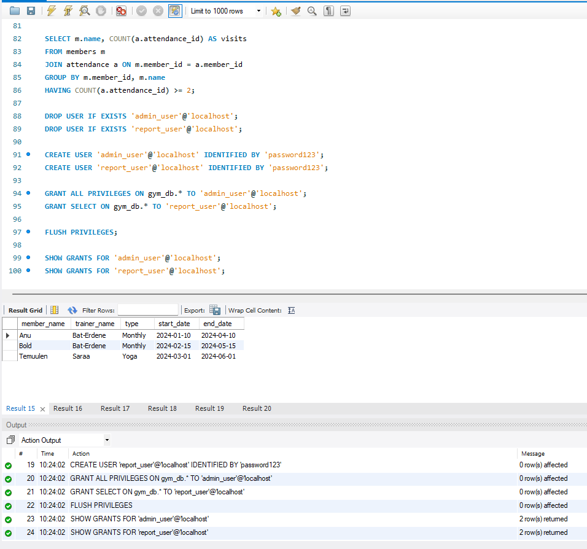
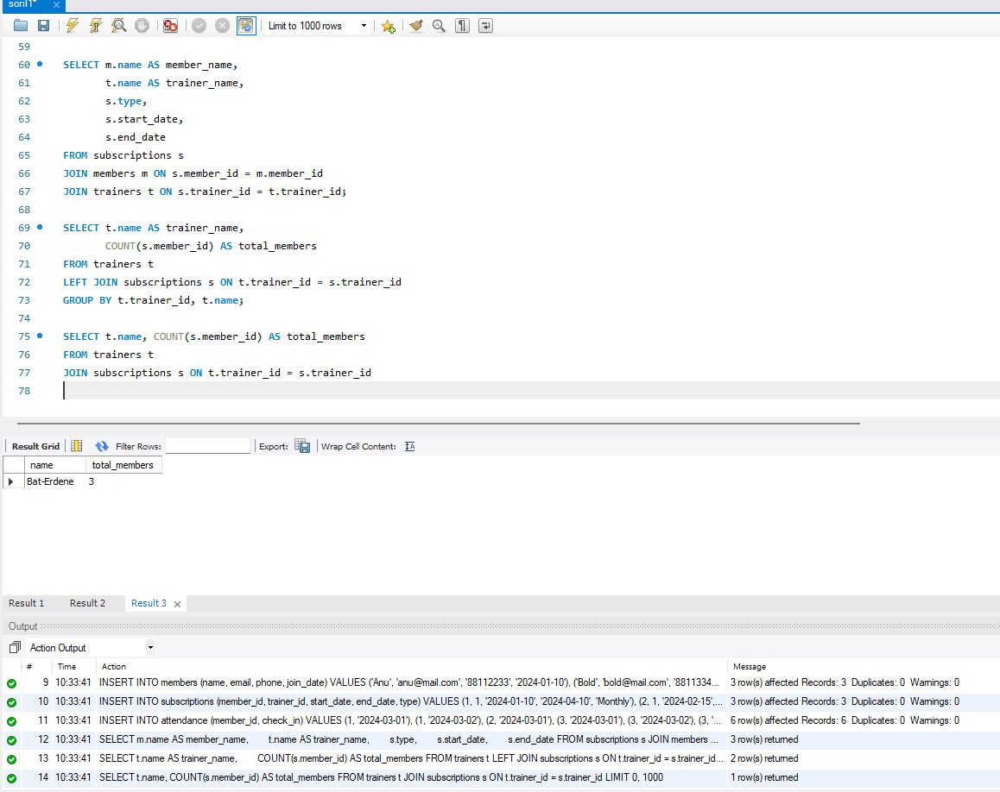
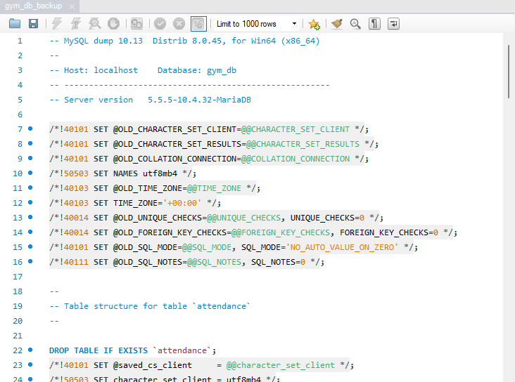

# Сорил 1

Энэхүү төсөл нь фитнес төвийн багш, гишүүд болон ирцийн бүртгэлийг удирдах өгөгдлийн сангийн бүтэц, санхүүгийн эрхийн тохиргоог агуулсан болно.

## Файлын бүтэц

* soril1.sql: Өгөгдлийн сан үүсгэх, хүснэгт үүсгэх, өгөгдөл оруулах болон хандах эрхийг тохируулах үндсэн файл.
* README.md: Төслийн бүтэц болон скриптийн тайлбар бүхий заавар файл.

## SQL Script тайлбар

soril1.sql файл нь дараах хэсгүүдээс бүрдэнэ:

### 1. Database үүсгэх
"gym_db" нэртэй өгөгдлийн санг шинээр үүсгэж ашиглахад бэлтгэнэ. Хэрэв өмнө нь ийм нэртэй сан байвал устгаж шинээр үүсгэхээр тохируулсан.

### 2. Хүснэгтүүд (PK, FK)
Дараах үндсэн хүснэгтүүдийг Primary Key болон Foreign Key-ийн холбоостойгоор үүсгэнэ:
* trainers: Багш нарын мэдээлэл (Нэр, мэргэшил, утас).
* members: Гишүүдийн мэдээлэл (Нэр, и-мэйл, утас, бүртгүүлсэн огноо).
* subscriptions: Гишүүнчлэлийн төрөл болон багштай холбогдсон мэдээлэл.
* attendance: Өдөр тутмын ирцийн бүртгэл.

### 3. Sample data (INSERT)
Туршилтын зорилгоор багш нар, гишүүд, тэдгээрийн идэвхтэй гишүүнчлэл болон ирцийн мэдээллийг хүснэгтүүдэд оруулна.

### 4. Query-үүд (JOIN, GROUP BY, HAVING)
Өгөгдлийн сангаас хэрэгцээт мэдээллийг шүүж харах дараах үйлдлүүдийг багтаасан:
* Гишүүд болон тэдгээрийн хариуцсан багш нарын мэдээллийг нэгтгэж харах (JOIN).
* Багш бүр дээрх нийт гишүүдийн тоог гаргах (GROUP BY).
* Хамгийн их ачаалалтай буюу хамгийн олон гишүүнтэй багшийг тодорхойлох.
* Тодорхой тооноос дээш удаа ирсэн гишүүдийг шүүх (HAVING).

### 5. Хэрэглэгчийн эрх болон Privilege
Аюулгүй байдлыг хангах үүднээс хоёр төрлийн хэрэглэгч үүсгэж эрх олгоно:
* admin_user: Өгөгдлийн сан дээрх бүх үйлдлийг хийх бүрэн эрхтэй (ALL PRIVILEGES) хэрэглэгч.
* report_user: Зөвхөн мэдээлэл харах (SELECT) эрхтэй тайлангийн хэрэглэгч.# /project

Энэхүү төсөл нь фитнес төвийн багш, гишүүд болон ирцийн бүртгэлийг удирдах өгөгдлийн сангийн бүтэц, санхүүгийн эрхийн тохиргоог агуулсан болно.

## Файлын бүтэц

* mysqlScript.sql: Өгөгдлийн сан үүсгэх, хүснэгт үүсгэх, өгөгдөл оруулах болон хандах эрхийг тохируулах үндсэн файл.
* README.md: Төслийн бүтэц болон скриптийн тайлбар бүхий заавар файл.

## SQL Script тайлбар

mysqlScript.sql файл нь дараах хэсгүүдээс бүрдэнэ:

### 1. Database үүсгэх
"gym_db" нэртэй өгөгдлийн санг шинээр үүсгэж ашиглахад бэлтгэнэ. Хэрэв өмнө нь ийм нэртэй сан байвал устгаж шинээр үүсгэхээр тохируулсан.

### 2. Хүснэгтүүд (PK, FK)
Дараах үндсэн хүснэгтүүдийг Primary Key болон Foreign Key-ийн холбоостойгоор үүсгэнэ:
* trainers: Багш нарын мэдээлэл (Нэр, мэргэшил, утас).
* members: Гишүүдийн мэдээлэл (Нэр, и-мэйл, утас, бүртгүүлсэн огноо).
* subscriptions: Гишүүнчлэлийн төрөл болон багштай холбогдсон мэдээлэл.
* attendance: Өдөр тутмын ирцийн бүртгэл.

### 3. Sample data (INSERT)
Туршилтын зорилгоор багш нар, гишүүд, тэдгээрийн идэвхтэй гишүүнчлэл болон ирцийн мэдээллийг хүснэгтүүдэд оруулна.

### 4. Query-үүд (JOIN, GROUP BY, HAVING)
Өгөгдлийн сангаас хэрэгцээт мэдээллийг шүүж харах дараах үйлдлүүдийг багтаасан:
* Гишүүд болон тэдгээрийн хариуцсан багш нарын мэдээллийг нэгтгэж харах (JOIN).
* Багш бүр дээрх нийт гишүүдийн тоог гаргах (GROUP BY).
* Хамгийн их ачаалалтай буюу хамгийн олон гишүүнтэй багшийг тодорхойлох.
* Тодорхой тооноос дээш удаа ирсэн гишүүдийг шүүх (HAVING).

### 5. Хэрэглэгчийн эрх болон Privilege
Аюулгүй байдлыг хангах үүднээс хоёр төрлийн хэрэглэгч үүсгэж эрх олгоно:
* admin_user: Өгөгдлийн сан дээрх бүх үйлдлийг хийх бүрэн эрхтэй (ALL PRIVILEGES) хэрэглэгч.
* report_user: Зөвхөн мэдээлэл харах (SELECT) эрхтэй тайлангийн хэрэглэгч.

*https://github.com/Soulealo/Soril1.git

